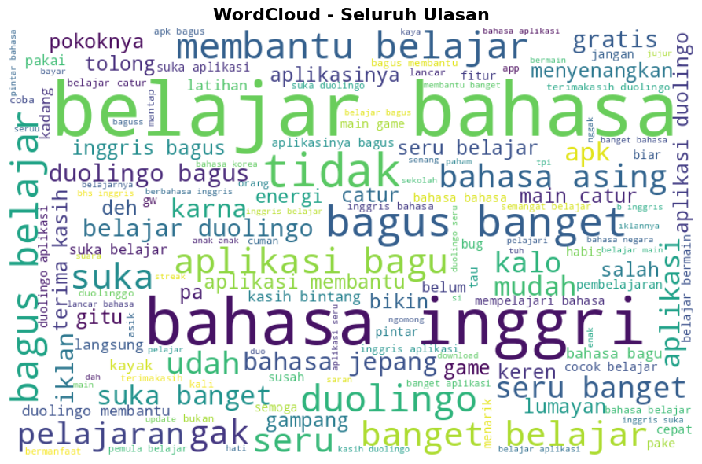
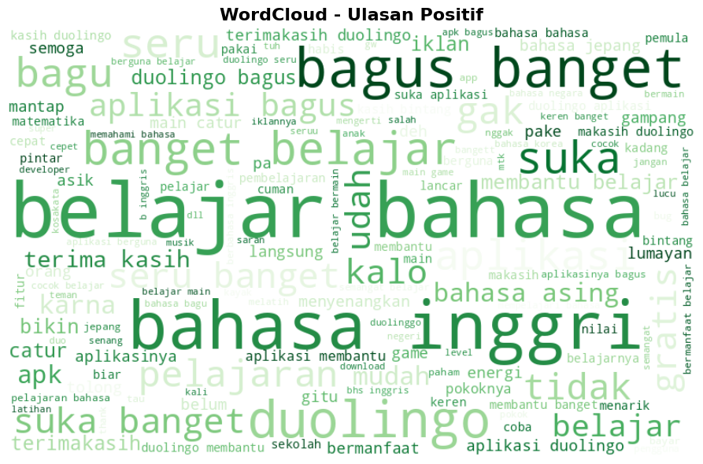
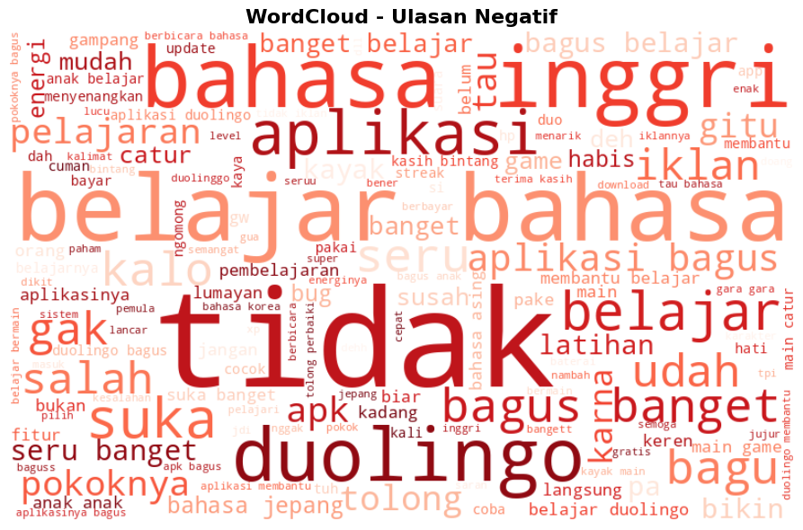
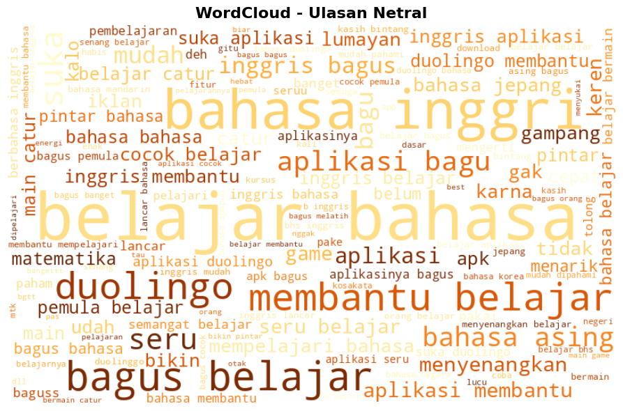
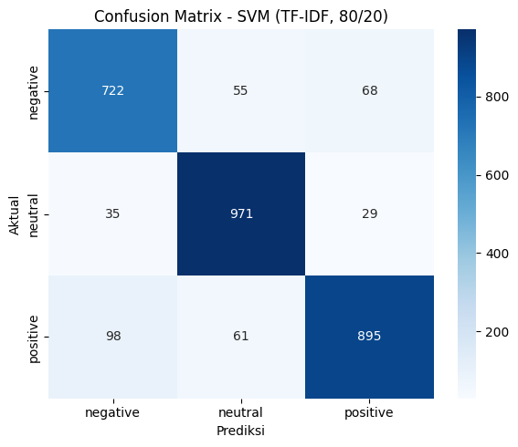

# Analisis Sentimen Ulasan Aplikasi Duolingo (Google Play Store)

Proyek ini melakukan analisis sentimen terhadap ulasan pengguna aplikasi **Duolingo** yang diambil dari Google Play Store. Ulasan diklasifikasikan ke dalam tiga kelas sentimen — **positif**, **netral**, dan **negatif** — menggunakan kombinasi pendekatan *lexicon-based labeling* dan beberapa model machine learning serta deep learning.

## Daftar Isi

- [Ringkasan Proyek](#ringkasan-proyek)
- [Dataset](#dataset)
- [Metodologi](#metodologi)
- [Visualisasi](#visualisasi)
- [Hasil Model](#hasil-model)
- [Struktur Repository](#struktur-repository)
- [Cara Menjalankan](#cara-menjalankan)
- [Limitasi](#limitasi)

## Ringkasan Proyek

- **Sumber data**: ulasan aplikasi Duolingo (`com.duolingo`) di Google Play Store, diambil menggunakan `google-play-scraper`
- **Jumlah data**: ±14.600 ulasan setelah proses cleaning
- **Jumlah kelas**: 3 (positif, netral, negatif)
- **Metode pelabelan**: lexicon-based (InSet Lexicon), dengan perbaikan penanganan konflik kamus dan negasi kata
- **Model yang digunakan**: SVM, LSTM, dan Bidirectional LSTM
- **Akurasi terbaik**: ±88-89% pada data uji di seluruh skema pelatihan

## Dataset

Data ulasan diambil dengan parameter berikut:

| Parameter | Nilai |
|---|---|
| ID Aplikasi | `com.duolingo` |
| Bahasa | Indonesia (`id`) |
| Negara | Indonesia (`id`) |
| Urutan | `Sort.MOST_RELEVANT` |
| Jumlah diambil | 15.000 ulasan |
| Jumlah setelah cleaning | ±14.669 ulasan |

Kode scraping tersedia di [`scraping.ipynb`](scraping.ipynb).

## Metodologi

### 1. Text Preprocessing
Pipeline pembersihan teks meliputi:
- Cleaning (menghapus mention, hashtag, URL, angka, tanda baca)
- Case folding
- Normalisasi kata gaul/slang (kamus manual + [Kamus Alay](https://github.com/nasalsabila/kamus-alay))
- Tokenisasi
- Stopword removal (dengan pengecualian kata negasi seperti *tidak*, *gak*, *belum*, agar makna kalimat tidak terbalik)

### 2. Pelabelan Sentimen (Lexicon-Based)
Label dihasilkan menggunakan [InSet Lexicon](https://github.com/fajri91/InSet) (leksikon sentimen Bahasa Indonesia), dengan beberapa perbaikan:
- Menghapus kata yang muncul di kedua leksikon (positif & negatif) dengan skor bertentangan
- Mengecualikan kata topik netral yang bukan penanda sentimen (misalnya *bahasa*, *aplikasi*)
- Menambahkan penanganan negasi sederhana, sehingga frasa seperti *"gak nyesel"* dikenali sebagai sentimen positif, bukan negatif

Distribusi label akhir:

| Sentimen | Jumlah | Persentase |
|---|---|---|
| Positif | 5.267 | 35.9% |
| Netral | 5.177 | 35.3% |
| Negatif | 4.225 | 28.8% |

### 3. Ekstraksi Fitur & Pelatihan Model
Tiga skema pelatihan diterapkan dengan variasi algoritma, ekstraksi fitur, dan pembagian data:

| Skema | Algoritma | Ekstraksi Fitur | Split |
|---|---|---|---|
| 1 | SVM | TF-IDF | 80/20 |
| 2 | LSTM | Tokenizer + Embedding | 80/20 |
| 3 | Bidirectional LSTM | Word2Vec | 70/30 |

## Visualisasi

### Distribusi Kata — WordCloud

| Seluruh Ulasan | Ulasan Positif |
|---|---|
|  |  |

| Ulasan Negatif | Ulasan Netral |
|---|---|
|  |  |

### Confusion Matrix — SVM (TF-IDF, split 80/20)



## Hasil Model

| Skema | Metode | Akurasi Train | Akurasi Test |
|---|---|---|---|
| 1 | SVM + TF-IDF (80/20) | 91.92% | 88.21% |
| 2 | LSTM + Tokenizer/Embedding (80/20) | 94.14% | 88.55% |
| 3 | Bi-LSTM + Word2Vec (70/30) | 94.14% | 88.55% |

Ketiga skema menghasilkan akurasi data uji yang relatif konsisten (~88-89%), mengindikasikan performa model kemungkinan sudah mendekati batas atas yang dipengaruhi kualitas pelabelan berbasis lexicon.

## Struktur Repository

```
├── Sentiment_Analysis.ipynb   # Notebook utama: preprocessing, labeling, training, evaluasi, inference
├── scraping.ipynb              # Notebook proses scraping data dari Google Play Store
├── requirements.txt            # Daftar dependency Python
├── ulasan_aplikasi.csv         # Dataset hasil scraping
├── images/                     # Visualisasi (wordcloud, confusion matrix)
└── README.md
```

## Cara Menjalankan

1. Clone repository ini
   ```bash
   git clone <url-repository-ini>
   cd <nama-folder>
   ```
2. Install dependency
   ```bash
   pip install -r requirements.txt
   ```
3. (Opsional) Jalankan `scraping.ipynb` untuk mengambil ulang data terbaru dari Google Play Store
4. Jalankan `Sentiment_Analysis.ipynb` untuk melihat keseluruhan proses preprocessing, pelabelan, pelatihan model, dan inference

## Limitasi

- Label sentimen dihasilkan secara otomatis melalui pendekatan lexicon-based, bukan anotasi manual, sehingga berpotensi kurang akurat pada kalimat dengan sentimen implisit, sarkasme, atau struktur negasi yang kompleks (misalnya *"tidak terlalu istimewa tapi juga tidak buruk"*).
- Model dilatih tanpa pretrained language model besar (seperti BERT/IndoBERT), sehingga performa pada kalimat yang kompleks secara linguistik masih terbatas dibanding pendekatan berbasis transformer.
